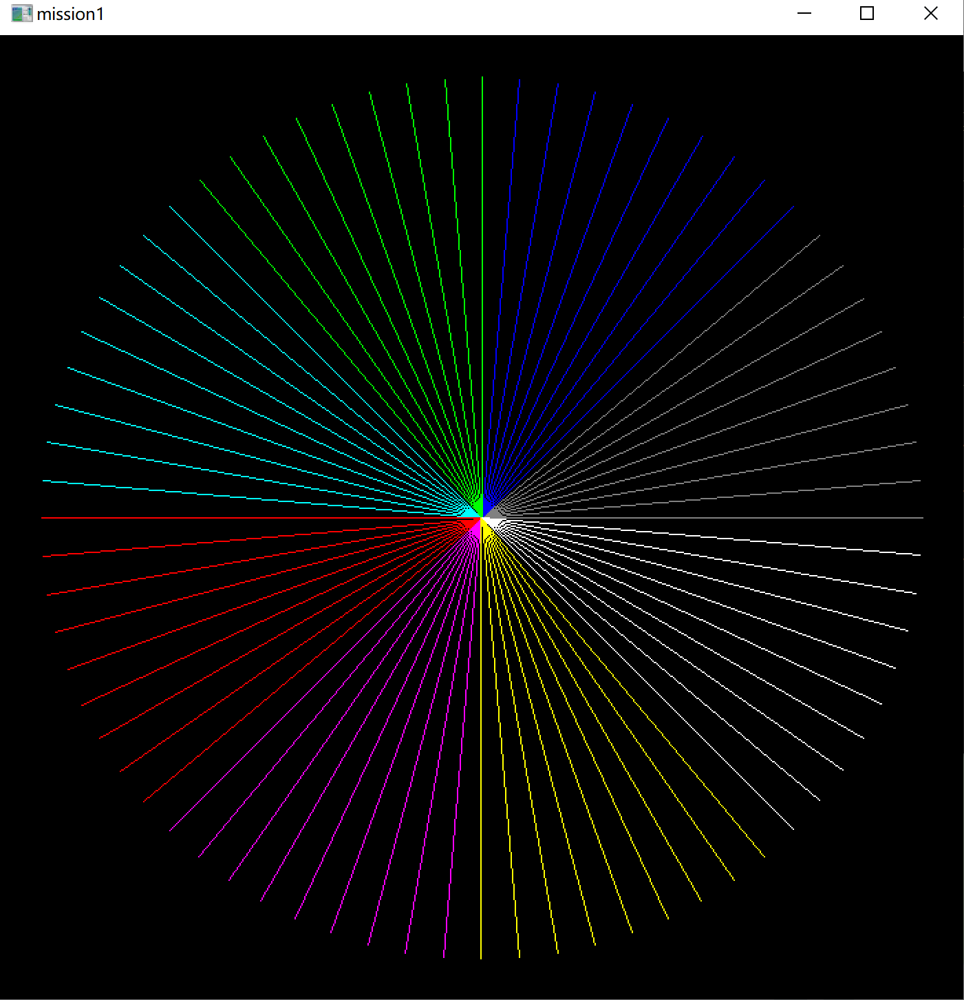
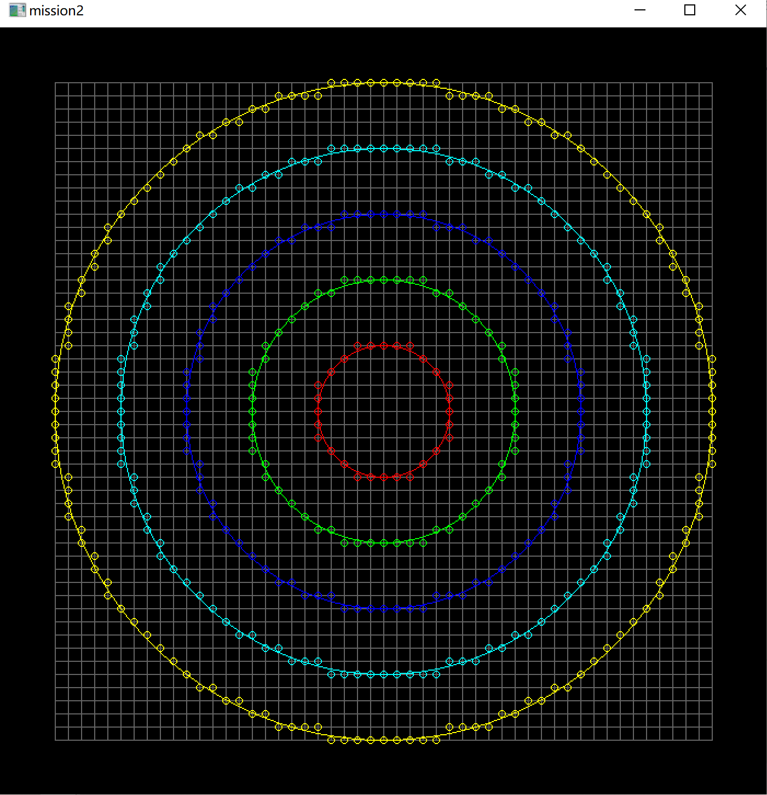
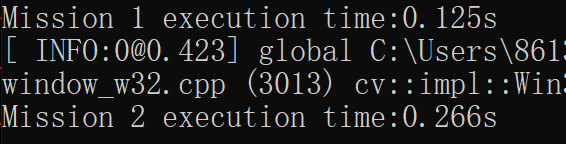
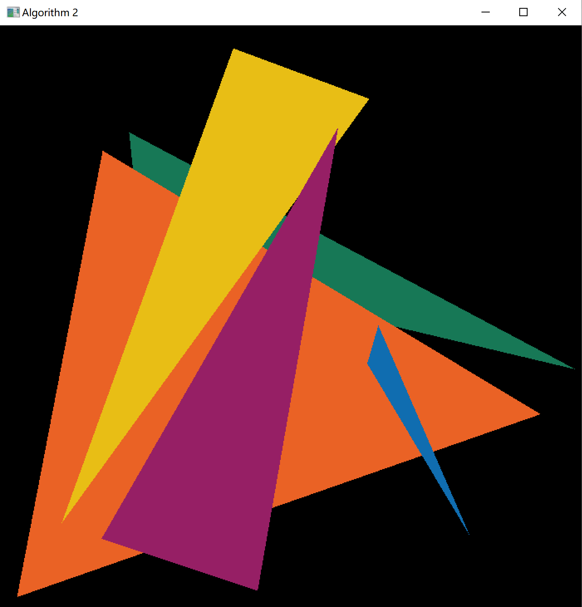

# 2D Rasterizer

## Bresenham Rasterizing
This repository contains C++ code for a rasterizer based on the Bresenham line algorithm and circle drawing algorithm. The code includes implementations for the `Rasterizer` class along with a `main.cpp` file for demonstrating the use of the rasterizer.

### Files

#### rasterizer.h

This file contains the implementation of the `Rasterizer` class, which provides methods for drawing lines, circles, and patterns based on the Bresenham line and circle drawing algorithms. The class also includes functions for clearing the frame buffer and obtaining the frame buffer contents.

#### rasterizer.cpp

This file provides the implementation for the functions defined in `rasterizer.h`, including the Bresenham line and circle drawing algorithms. It also includes methods for drawing patterns and manipulating the frame buffer.

#### main.cpp

The `main.cpp` file demonstrates the usage of the `Rasterizer` class by executing two different tasks. It initializes the rasterizer, performs the tasks, and displays the resulting images. The tasks involve drawing specific patterns and shapes using the Bresenham line and circle drawing algorithms.

#### global.h

This header file contains a constant definition for the mathematical constant PI.

### Screenshots

Here are the screenshots of the output generated by the sample application:

- Task 1 Output:
  

- Task 2 Output:
  

- Performance Measurement:
  

### Algorithm Used

The rasterizer utilizes the Bresenham line algorithm for drawing lines and the Bresenham circle drawing algorithm for drawing circles.

## Triangle Rasterizing

`.\TriangleRasterizing\` contains C++ code for a simple triangle rasterizer. The code includes implementations for the `Triangle` and `Rasterizer` classes, along with a `main.cpp` file for demonstration.

### Files

#### Triangle.h

This file contains the implementation of the `Triangle` class, which represents a triangle with specified vertices and color. The class includes methods for calculating the bounding box and edge equations of the triangle.

#### Rasterizer.h

The `Rasterizer` class is defined in this file, which includes functions for rasterizing triangles and shading pixels. The class uses OpenCV for image processing and manipulation. It provides methods for shading individual pixels, rasterizing triangles, and displaying the resulting image.

#### Rasterizer.cpp

This file provides the implementation for the functions defined in `Rasterizer.h`. It includes methods for shading pixels and rasterizing triangles using both optimized and non-optimized algorithms.

#### main.cpp

The `main.cpp` file includes a demonstration of the triangle rasterizer with sample triangles. It initializes the rasterizer, generates a set of triangles, and utilizes both optimized and non-optimized algorithms for triangle rasterization. The file also measures the computation time for each algorithm and displays the results.

### Screenshots

Here are the screenshots of the output generated by the sample application:

- Algorithm 1:
  

- Algorithm 2: (Identical)
  

- Computation Time Comparison:
  

## How to Run

To run the demonstration, compile the code with the necessary dependencies and execute the resulting executable. Make sure to include the required libraries, such as Eigen and OpenCV, before compilation.

## Dependencies

- Eigen3: x64-windows 3.4.0
- OpenCV: x64-windows 4.5.5

Make sure to have the dependencies installed before attempting to run the code. Preferably using vcpkg.

## Author

Kaleido is my nickname;)

For any inquiries, please contact the author at 1666294920@qq.com.

